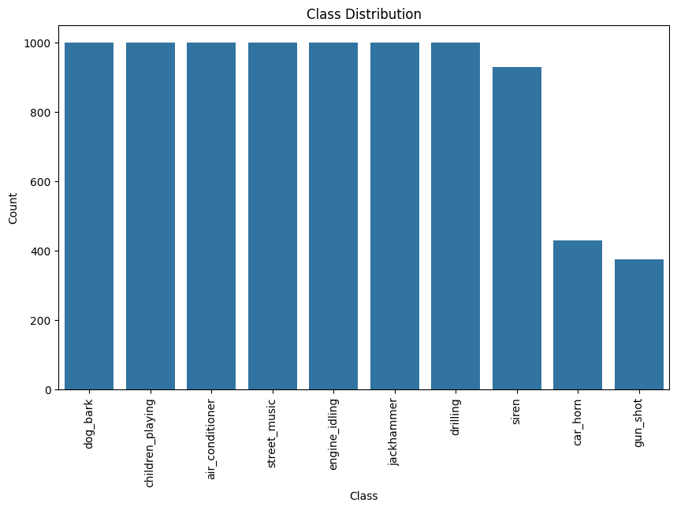
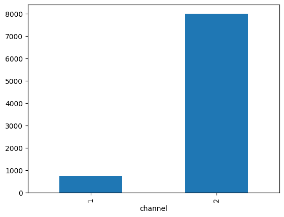
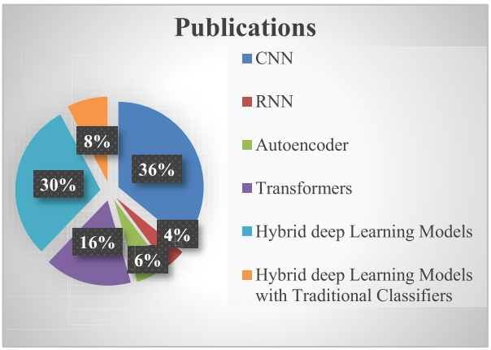
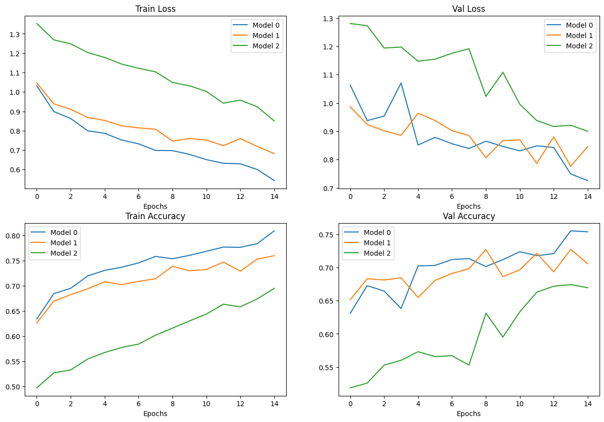
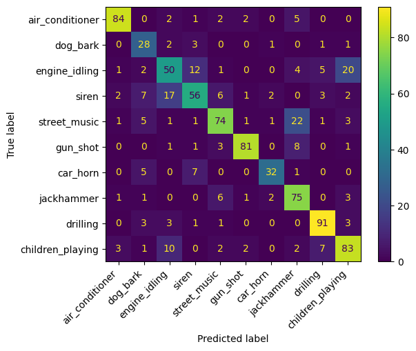
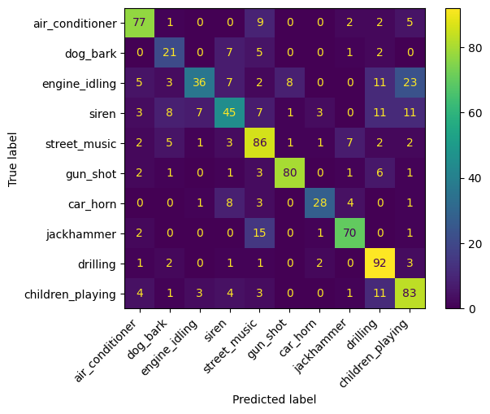
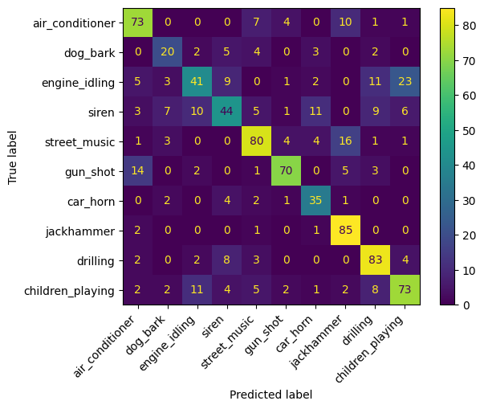

```{r setup, include=FALSE}
knitr::opts_chunk$set(echo = TRUE)
library(kableExtra)
```

\newpage

# Introduction

The present report outlines the thinking and decisions made during the implementation of deep learning methods for audio. As outline in the problem instructions, the objective we are after with this piece of work is to apply deep learning techniques to solve real-world problems in multimedia processing, specifically focusing on audio processing tasks. All code is written in python and the deep learning package pytorch for implementing all the deep learning techniques.

# Problem Statement Selection

For this thrid and last assessment the problem we selected to work on was the **Environmental Sound Classification**. This type of problem falls into the broader field of **Audio Detection and Classification**, which involves identifying and categorizing various audio signals into predefined classes, such as  music, conversation, animal sounds, or noise, using machine learning techniques. This field encompasses a wide range of tasks, including speech recognition, music genre classification, and environmental sound classification [@arnault2020urban].

Audio classification has numerous practical applications across various domains. In smart cities [@zhang2023automatic; @bansal2022comparative], it can be used for monitoring urban environments to detect sounds like gunshots, car accidents, or construction noise, enhancing public safety and urban planning. In healthcare, audio classification can assist in diagnosing respiratory conditions by analyzing cough sounds or monitoring patients’ sleep patterns for sleep disorders. Consumer electronics benefit from audio classification through voice-activated assistants like Alexa and Siri, which rely on accurately identifying and responding to user commands. In wildlife monitoring, it helps in tracking animal populations and behaviors by classifying animal calls, aiding in conservation efforts. Additionally, in entertainment, it enhances user experiences by enabling features like automatic music tagging and recommendation systems. These applications demonstrate the versatility and impact of audio classification in improving various aspects of daily life and industry.

## Dataset

The dataset for this problem is the **URBANSOUND** which was put together by [@salamon2014dataset]. This dataset contains a comprehensive collection of urban sound recordings designed to address key challenges in urban sound research. The authors in their paper highlight the following characteristics:

- It includes 27 hours of field recording with 18.5 hours of annotated sound events across 10 sound classes such as air conditioner, car horn, children playing, dog bark, drilling,  engine idling, gun shot, jackhammer, siren and street music.

- It aims to provide a large, real-world dataset to facilitate research in automatic urban sound classification and to overcome the scarcity of annotated data.

- Each recording is manually annotated, including start and end times of sound occurrences and their salience (foreground and background).

- **UrbanSound8k** is a subset of the dataset, containing short audio snippets, and has been designed for training sound classification algorithms.

The selected dataset consists of 8,732 labeled sound excerpts of about 4 seconds long. It contains audio files and labels of ten categories: *air_conditioner*, *car_horn*, *children_playing*, *dog_bark*, *drilling*, *enginge_idling*, *gun_shot*, *jackhammer*, *siren*, and *street_music.*

After downloading the dataset, we saw that it consists of two parts:

- Audio files, contained in the 'audio' folder. It has 10 sub-folders named 'fold1' to 'fold10' containing '.wav' audio sample.
- Metadata, contained in the 'metadta' folder. The data is contained in a csv file called 'UrbanSound8k.csv' with information about each audio sample int the dataset.

The columns contained in the metadata file are the following:

* slice_file_name: The name of the audio file.
* fsID: The Freesound ID of the recording from which this excerpt (slice) is taken.
* start: The start time of the slice in the original Freesound recording.
* end: The end time of slice in the original Freesound recording.
* salience: A (subjective) salience rating of the sound. 1 = foreground, 2 = background.
* fold: The fold number (1-10) to which this file has been allocated.
* classID: A numeric identifier of the sound class:

    0 = air_conditioner     
    1 = car_horn    
    2 = children_playing    
    3 = dog_bark    
    4 = drilling    
    5 = engine_idling   
    6 = gun_shot    
    7 = jackhammer  
    8 = siren   
    9 = street_music    

* class: The class name: air_conditioner, car_horn, children_playing, dog_bark, drilling, engine_idling, gun_shot, jackhammer, 
siren, street_music.

### Data Exploration

In audio classification, similar to image classification, we provide the model with visual representations of sound. This is achieved through a spectrogram, which illustrates the sound’s features by showing how its frequency content varies over time. Brighter regions on the spectrogram indicate higher energy or amplitude. This method enables us to see not only the general pitch and loudness of the sound but also finer details like harmonics. A few examples of audio files from the dataset are shown in Figure \@ref(fig:imagesamples).

```{r imagesamples, fig.show='hold', echo=FALSE, out.width="90%", fig.cap="Training Images sample by class", fig.align="center"}
knitr::include_graphics(c("./images/sample1_spectrogram.png", "./images/sample2_spectrogram.png", "./images/sample3_spectrogram.png"))
```


The class distribution of the dataset can be seen in Figure \@ref(fig:classdistribution). As can be seen, the classes are imbalanced.

```{r classdistribution, fig.show='hold', echo=FALSE, out.width="90%", fig.cap="Class distribution", fig.align="center"}

```


A look at the channels in figure \@ref(fig:channels) we can see that most of them have two and a few have one.


```{r channels, echo=FALSE, out.width="90%", fig.cap="Class distribution", fig.align="center"}

```

\newpage
# Approach

We have used the work done in assessment 2 (image classification problem) as a template to drive the implementation of this assignment. To develop the audio classification model using pytorch, the initial focus was on a literature review. This phase aimed to explore the diverse landscape of audio classification models and architectures, drawing insights from research papers like the models's strengths, weaknesses and performance characteristics. This knowledge served a a foundation for selecting three architecture to use in the solution of this assessment. The subsequent steps (building the models, training and evaluating) will follow the standard machine learning pipeline, encompassing data preprocessing, model training and evaluation.

We aimed to approach this assessment in a trial and error way by experimenting with different components of the work in small chunks and understand how it works, so later we can put all together in a bigger scale.

As requested in the assessment, we have used pytorch as our framework to train the models.

# Deep Learning Models

Deep learning models offer high accuracy and adaptability but require significant computational resources and large datasets. In a literature review done by [@zaman2023survey] the authors surveyed various deep learning models used for audio classification, including CNNs, RNNs, Autoencoders, Transformers and Hybrid Models. These models have been used for tasks such as speech recognition, music genre identification, environmental sound classification, and emition recognition. Their results showed (\@ref(fig:publications)) that CNNs are the most preferred architecture, followed by hybrid deep learning models and transformers. Based on this statistics we decided to try CNN and hybrid models.

```{r publications, echo=FALSE, out.width="90%", fig.cap="Number of publications by type of architecture.", fig.align="center"}

```

The three models we implemented are:

a. CNN (Convolutional Neural Networks): According to [@zaman2023survey] CNNs are highly effective for audio classification tasks due to their ability to capture spatial features from spectrograms, which are 2D representations of audio signals. They excel in tasks like speech recognition, music genre classification, and environmental sound classification by learning complex patterns in the data.

b. CRNN (Convolutional Recurrent Neural Network): CRNNs are a good combination according to [@sang2018convolutional] as CNNs extract high-level features form the sound, while RNNs handle the temporal aggregation of these features, capturing sequential information effectively.

c. CNN-LSTM (Hybrid): Hybrid models combine the strengths of CNNs and RNNs. CNNs can extract spatial features from spectrograms, while LSTMs can capture temporal dependencies. This combination is powerful for tasks like speech recognition, audio classification, and emotion recognition, as it leverages both spatial and temporal information for improved accuracy and robustness.

## CNN

This network consists of three convolutional layers followed by max pooling layers, and two fully connected layers for final classification. The first convolution layer (self.conv1) has 16 output channels, the second (self.conv2) has 32, and the third (self.conv3) has 64, all with a kernel size of 3x3, stride of 1, and padding of 1. Each convolution layer is followed by a ReLU activation and a max pooling layer (self.pool) with a kernel size of 2x2 and stride of 2. The output size after the CNN layers is calculated for the first fully connected layer (self.fc1), which has 128 output features and uses ReLU activation. The second fully connected layer (self.fc2) maps to the number of output classes (num_classes). The forward method processes the input through the convolutional layers, flattens the output, and passes it through the fully connected layers to produce the final class predictions.


## CRNN

This network is designed for tasks requiring both spatial and temporal feature extraction, such as audio classification. The architecture combines convolutional layers for spatial feature extraction with a Gated Recurrent Unit (GRU) for temporal sequence modeling. It includes two convolutional layers: the first with 16 output channels and the second with 32, both followed by ReLU activation and max pooling to reduce spatial dimensions. The GRU layer is bidirectional with a specified hidden size and number of layers, capturing temporal dependencies. The fully connected layer maps the GRU output to the desired number of classes. In the forward pass, the input is processed through the convolutional layers, flattened, and passed through the GRU. The output from the last time step of the GRU is then passed through the fully connected layer to produce the final class predictions. This CRNN architecture effectively combines CNNs for spatial feature extraction and GRUs for temporal sequence modeling, making it well-suited for tasks like audio classification.


## CNN-LSTM

This network combines Convolutional Neural Networks (CNNs) and Long Short-Term Memory (LSTM) networks for tasks requiring both spatial and temporal feature extraction, such as audio classification. The model includes three convolutional layers with 16, 32, and 64 output channels, respectively, each followed by ReLU activation and max pooling to reduce spatial dimensions. The LSTM layer has an input size based on the CNN output, a hidden size of 128, and 2 layers, with a dropout of 0.2 to prevent overfitting. The forward pass processes the input through the convolutional layers, reshapes it for the LSTM, and passes it through the LSTM with initial hidden and cell states set to zeros. The output from the last time step of the LSTM is then passed through two fully connected layers to produce the final class predictions. This architecture effectively combines CNNs for spatial feature extraction and LSTMs for temporal sequence modeling.


# Methodology

The methodology followed in the implementation of this work werethese steps:

a. Data collection: The data was downloaded from the google drive website and saved locally for further processing.

b. Data pre-processing: Here we performed all the neccesary data exploration in order to understand the structure of the dataset we worked on. We explored how the classes were structured in the folders, the resolution of the images and  the distribution of the classes. After exploring the dataset, we constructed the dataset classes pytorch uses for managing data during the training process.

c. Model building: In this step, we implemented the pytorch classes for the three chosen models by writing pytorch classes with their corresponding parameters and architecture.

d. Model training: In this step, we trained the models over the training dataset. We use the validation dataset to get a better indication of the performance of the model.

f. Model evaluation: For the final evaluation we used the test dataset that was provided and calculated the accuracy and the confusion matrix in order to analyse the performance of the model around all the classes.


# Experimental Setup

The work was conducted on a laptop with an 8GB integrated NVIDIA RTX A2000 GPU.

The parameters used are the following:

- Batch size: 128
- Learning rate: 0.001
- Number of epoch: 15

The UrbanSound8K dataset is divided into 10 folders and the authors recommended to use the folds for doing a 10-fold cross-validation to report metrics and evaluate the performance of our model. However, to keep things simple for this assessment and focus on modeling audio classification with deep learning algorithms example rather than to obtain the best metrics, we will ignore the folds and treat all the samples simply as one large dataset.

The dataset was splitted into three groups, 70% for training, 20% for validation and 10% for testing. The testing dataset was left alone and was used for evaluating the generalisation performance of the models.

As for data augmentation we performed the following transformations:

- Channels were standarised to 2 in all sound files.
- Duration was standarised to 4 seconds.
- Sampling rate was set to 44100 Hz
- Small time shift applied to sound randomly.
- Audio converted to a Mel-Spectrogram resulting a input shape of 2 channels, 64 mel frequency bands, 342 time steps.

In terms of training, the following parameters were used in each model:

* We defined our cost function as cross entropy loss.
* Optimizer as Adam

# Results

The overall validation accuracy obtained for each model is shown in Table.

```{r overallaccuracy, echo=FALSE}
performances <- data.frame(
  `Model name` = c('CNN', 'CRNN', 'CNN-LSTM'),
  `Train accuracy` = c('74.24%', '71.31%', '60.17%'),
  `Val accuracy` = c('70.14%', '69.21%', '59.70%'),
  `Training time (secs)` = c(2210.711, 1726.098, 1520.272)
)

knitr::kable(performances, caption = "Model Performances.") %>% 
  kable_styling(latex_options = "HOLD_position")
```


```{r modelresults, echo=FALSE, out.width="90%", fig.cap="Model Results", fig.align="center"}

```

The charts above illustrate the difference of performance between the models. Clearly, CNN model (model_0) has the highest accuracy in the training and validation datasets. The CRNN model shows a very similar performance in accuracy during training and similar variability in the validation accuracy compared to CNN model. And the CNN-LSTM model performed the worst compared to the other two models in training and validation accuracy.

The charts above also better illustrate the difference of performance between the models. In the "Train Loss" graph, all three models show a downward trend as epochs increase, indicating an improvement in loss on the training set over time. The CNN model (model_0) has the steepest decline followed by CRNN model (model_1) and then CNN-LSTM (model_2).

The "Val Loss" graph shows fluctuations in loss on the validation set for all models as epochs increase. Unlike the training loss, these lines are not consistently decreasing which may indicate issues like overfitting or instability in learning.

In the "Train Accuracy" graph, there’s an upward trend for all models indicating improving accuracy on the training set as more epochs are completed. Here again, the CNN model shows rapid improvement initially and then stabilizes at a high accuracy level while the CRNN and CNN-LSTM models improve more gradually.

Lastly, in the "Val Accuracy" chart, there are significant fluctuations for all models with no clear upward or downward trend. This suggests that none of the models are consistently improving their performance on unseen data (validation set).

Overall insights from these graphs suggest that while all models improve their performance on training data over time (both in terms of loss and accuracy), their performances on validation data do not show consistent improvement which could be indicative of overfitting or lack of generalization ability.


## Model Performances

The models were evaluated with the test dataset. The table below provides the performance of the three models:

```{r modelperformances, echo=FALSE}
performances <- data.frame(
  `Model name` = c('CNN model', 'CRNN model', 'CNN-LSTM model'),
  `Model loss` = c(0.767416, 0.873223, 0.893735),
  `Model accuracy` = c('77.16%', '70.60%', '67.33%'),
  `Training time (secs)` = c(2210.711, 1726.098, 1520.272)
)

knitr::kable(performances, caption = "Model Performances.") %>% 
  kable_styling(latex_options = "HOLD_position")
```


From the results above we can see that the CNN model performed the best in the test dataset and CRNN with CNN-LSTM were somewhere close between each other. In terms of time the CNN model was the one that took the longest with 36 minutes approximately.

## Confusion Matrix

### **CNN (Figure \@ref(fig:cnnConfM))**

```{r cnnConfM, results='asis', echo=FALSE, out.width="90%", fig.cap="CNN Confusion Matrix", fig.align="center"}

```

The confusion matrix for the CNN model evaluated against the test data reveals insights about the model's performance across the ten categories: air conditioner, dog bark, engine idling, siren, street music, gun shot, car horn, jackhammer, drilling and children playing. 

- **High Accuracy**: The model shows high accuracy in categories such as 'drilling' with 91 correct predictions and 'air conditioner' with 84 correct predictions. This suggests that the CNN model is good at identifying these two specific classes.

- **Misclassifications**: There are some small misclassifications, for example, 'engine idling' was often confused with 'children playing' (20 times) and 'siren' (12 times), or 'street music' was confused a 'jackhammer' (22 times).

- **Improvement Areas**: The model could be improved in distinguishing between categories like 'engine idling' and 'children playing', as well as 'street music' and 'jackhammer', or 'siren' and 'engine idling'. 

While overall performance appears proficient, there is an opportunity to refine it further by reducing misclassifications among certain sound categories.


### **CRNN (Figure \@ref(fig:rnnConfM))**

```{r rnnConfM, echo=FALSE, out.width="90%", fig.cap="CRNN Confusion Matrix", fig.align="center"}

```

- **Air conditioner**: CRNN correctly identified 77 air conditioner sounds, compared to CNN's 84. However, RNN had fewer misclassifications with street music.
- **Dog bark**: CRNN correctly identified 21 dog barks, lower than CNN's results, and it had more missclassifications with siren and street music.
- **Engine idling**: CRNN identified 36 correct engine sounds, lower than CNN, but with the same level of missclassifications. This seems to be a hard class to identify for both models.
- **Siren**: CRNN correctly classified 45 siren sounds, lower than CNN, but with fewer errors in general with the other classes.
- **Street music**: CRNN correctly classified 86 sounds, higher than CNN, but with higher misclassifications than CNN.
- **Gun shot**: CRNN correctly identified 80 gun shot sounds, similar to CNN, indicating similar performance in this category.
- **Car horn**: CRNN correctly identified 28 car horn sounds, very close to CNN but lower.
- **Jackhammer**: CRNN correctly identified 70 jackhammer sounds, similar to CNN but lower, and with higher missclassifications as well.
- **Drilling**: CRNN showed a strong performance with 92 correct drilling sounds, one higher than CNN, and with lower misclassifications than CNN.
- **Children playing**: CRNN correctly identified 83 children playing sounds, exactly the same as to CNN, but with a better missclassification rate compared to CNN.

Overall, both models have good accuracy, with the CNN model showing higher precision across most categories. However, the RNN model shows promise in reducing specific misclassifications.

### **CNN-LSTM (Figure \@ref(fig:cnnlstmConfM))**

```{r cnnlstmConfM, echo=FALSE, out.width="90%", fig.cap="CNN-LSTM Confusion Matrix", fig.align="center"}

```

- **Air conditioner**: CNN-LSTM correctly identified 73 air conditioner sounds, lower than CNN's 84. However, RNN had also fewer misclassifications with street music.
- **Dog bark**: CNN-LSTM correctly identified 20 dog barks, lower than CNN's results, and it had more missclassifications with siren and street music.
- **Engine idling**: CNN-LSTM identified 41 correct engine sounds, lower than CNN, and with the higher levels of missclassifications. This seems to be a hard class to identify for both models as well.
- **Siren**: CNN-LSTM correctly classified 44 siren sounds, lower than CNN, and with higher errors in general with the other classes. This seems to be a hard class for this model.
- **Street music**: CNN-LSTM correctly classified 80 sounds, higher than CNN, and with lower misclassifications than CNN.
- **Gun shot**: CNN-LSTM correctly identified 70 gun shot sounds, lower than CNN, and with higher missclassifications than CNN as well.
- **Car horn**: CNN-LSTM correctly identified 35 car horn sounds, very close to CNN and the lowest classification category.
- **Jackhammer**: CNN-LSTM correctly identified 85 jackhammer sounds, higher than CNN and with lower missclassifications as well.
- **Drilling**: CNN-LSTM showed a strong performance with 83 correct drilling sounds, lower than CNN, and with higher misclassifications than CNN.
- **Children playing**: CNN-LSTM correctly identified 73 children playing sounds, lower than CNN, and with higher missclassification rate compared to CNN.

Overall, this model is the one with the lowest accuracy, however, the CNN-LSTM model shows promise in reducing specific misclassifications like 'jackhammer'.

\newpage
# Conclusions

In this assessment we built three deep learning models to classify environmental sounds from the UrbanSound8k dataset. The models we used were: CNN, CRNN and CNN-LSTM (Hybrid model).

The best model performed an accuracy of 75% on unseen data (CNN). This can be explained by the higher complexity RNN layers add to the model. CNN focuses solely on spatial feature extraction, which is often sufficient for this type of tasks (audio classification). This simplicity might be the reason for the better generalisation and higher accuracy. The extra complexity that GRU and LSTM add to the model might be the reason for the model overfitting and lower accuracy. Another factor to consider is that the dataset size is not large enough for justifying the extra complexity.

There is several things that can be improved in this assessment. Further experimentation can be done around:

- Adjusting the models parameters like increasing the model depth, trying with other learning rates, in other words, perform hyperparameter tunning.
- Utilise the full dataset of UrbanSounds instead of the 8k one.
- Test other models architectures proposed on the survey [@zaman2023survey].
- Try transfer learning with pre-trained models.

Working on this assignment was very challenging due to mainly work constraints and computing resources (GPU). Modeling is a try and error type of work that requires testing a lot of hypothesis, however, the testing is the part that can be very much time consuming.

# Key Learnings

- Simpler models like CNN can sometimes ourperform more complex architectures, especially when the dataset size is not big enough. The added complexity of RNN layers can lead to overfitting and longer training times without necessarily improving performance.

- Working with an 8GB GPU locally in this assessment and the previous one required careful management of resources. Batch sizes and model sizes had to be adjusted to fit within memory, highlighting the importance of optimizing code for available hardware.

- Extracting the model architecture from an academic paper is complex as due to limited space a paper has to put down all the information, a lot has to be carefully written and there high chances one would miss something important.

- This last assessment reinforced that developing efective deep learning models is an iterative process. Continuos experimentation, evaluation, and adaptation are key to achieving optimal results.


\newpage
# References

<div id="refs"></div>
