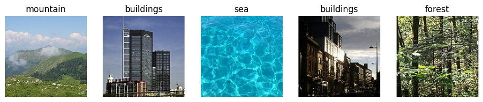
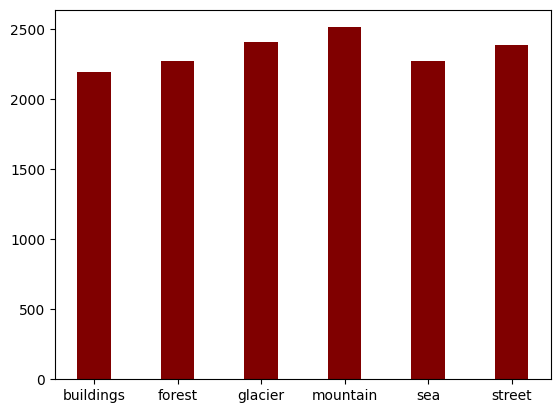
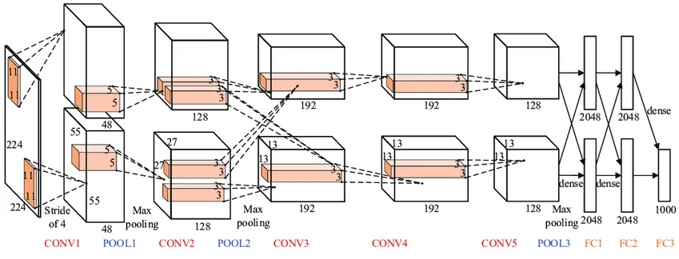
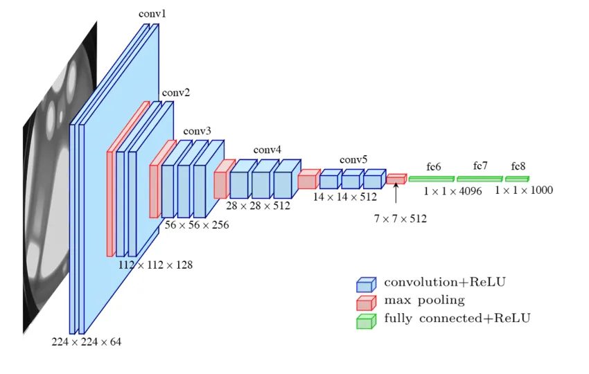
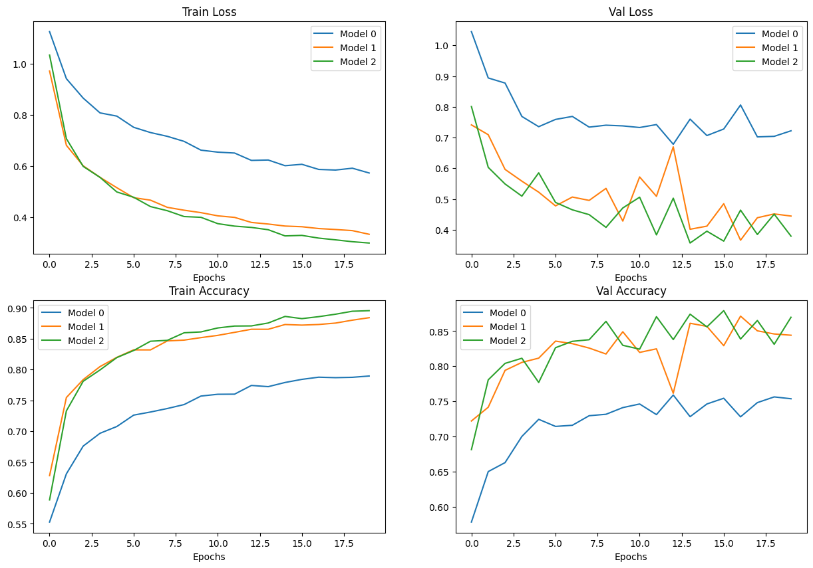
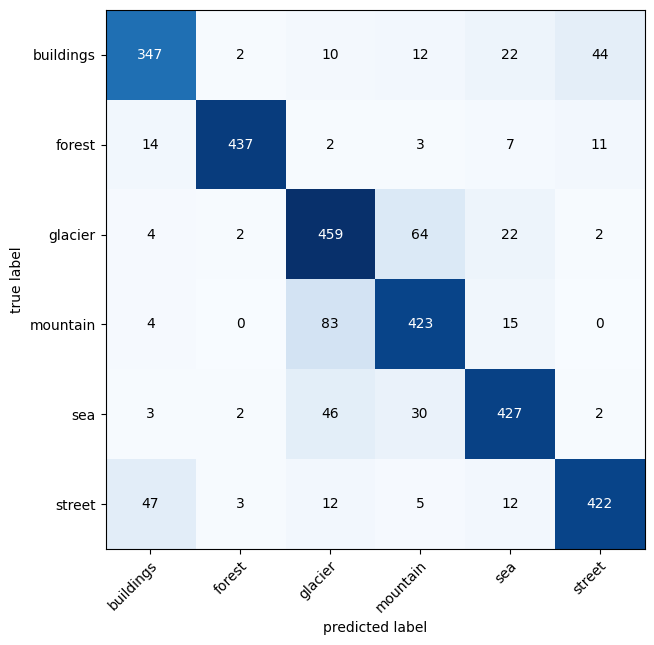
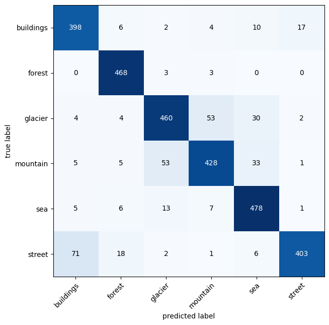

```{r setup, include=FALSE}
knitr::opts_chunk$set(echo = TRUE)
library(kableExtra)
```

\newpage

# Introduction

The present report outlines the thinking and decisions made during the implementation of a deep learning method for vision. 
As outline in the problem instructions, the objective of this work is to apply deep learning techniques to solve real-world problems in multimedia processing, specifically focusing on computer vision tasks. 
All code is written in python and the deep learning package pytorch for implementing all the deep learning techniques.

# Problem Statement Selection

For this second assessment the problem we selected to work on was the **visual product recognition problem**. This type of problem falls into the broader field of **Image Classification**, which involves identifying and classifying visual categories such as objects, scenes, and actions in images or videos [@liu2020efficient]. Therefore, the visual product recognition problem tackles the task of identifying and classifying products in images.

This can be particularly challenging because unlike general object recognition, products often have subtle variations within categories and can be affected by:

- Perspective: A product can look very different depending on the angle it's photographed.
- Lighting: Poor lighting or glare can obscure details.
- Occlusion: Products can be partially hidden by other objects or packaging.
- Scale: The size of the product in the image can vary.

Despite the challenges, visual product recognition is a rapidly growing field with significant potential due to:

- E-commerce: An image could be used to search for a product instead of text. This is useful particularly for users who struggle with descriptions or have difficulty finding the right keywords.
- Retail: Product recognition can help with stock management, targeted advertising, and even self-checkout systems, like the one implemented in amazon supermarket.
- Manufacturing: Automating product inspection on assembly lines or tracking inventory flow.
- Robotics: Equipping robots with the ability to identify and manipulate specific objects.

Some applications that visual product recognition could enable are:

- Visual search apps: Taking a picture of an item you saw in a magazine or friend's house and finding similar or identical products online for purchase.
- Smart shelves: Stores can track inventory in real-time, identify low stock situations, and potentially even automate re-ordering.
- Personalised advertising: In-store display or digital signage could recognise a customer and recommend products based on their past purchases or browsing habits.
- Augmented reality shopping: Trying on virtual clothes or furniture by pointing a phone at a physical space.

## Dataset

The dataset for this problem is the **Products-10k: Large Scale Product Recognition Dataset** which was put together by [@bai2020products], by collecting images from the online shopping website JD.com. It contains 10,000 fine-grained stock-keeping unit (SKU)-level products frequently purchased by online customers. The dataset covers a wide range of categories, including Fashion, 3C (electronics), food, healthcare, and household commodities.

According to [@bai2020products] the dataset presents several challenges:

1. Fine-grained similarity: Many of the SKU-level products are fine-grained and visually similar. Distinguishing between similar products based on a rough glimpse is challenging.

2. Large Number of Labels: The dataset contains a large amount of product labels due to its scale (10,000 products).

3. Noise and Labeling Quality: Existing product benchmarks suffer from either being too small (limited products) or having noisy labels (lack of accurate human labeling).

4. Unbalanced dataset:  Training with an unbalanced dataset may lead to basic performance in classification and result in performance drops in a balanced validation set due to model bias.

**Unfortunately given the difficulties faced with the product-10k dataset, the available resources (GPU) and the learning curve for this assessment, a decision was made to change datasets in order to complete the assignment.**

The dataset used in this assignment then is the 'Intel Image Classification' dataset. It contains 150 x 150 pixel RGB images of natural scenes around the world. It was used for an Image classification Competition in Kaggle (see https://paperswithcode.com/dataset/intel-image-classification) and used in several academic research papers.

The training and testing set consist of 14,034 and 3,000 samples accordingly. This dataset contains images and labels of six categories of natural scenes: *buildings*, *forest*, *glacier*, *mountain*, *sea* and *street*.

A few examples by class of images from the training dataset are shown in Figure \@ref(fig:imagesamples)

```{r imagesamples, echo=FALSE, out.width="90%", fig.cap="Training Images sample by class", fig.align="center"}

```


The class distribution of the dataset can be seen in Figure \@ref(fig:classdistribution)

```{r classdistribution, echo=FALSE, out.width="90%", fig.cap="Class distribution", fig.align="center"}

```

AS can be seen, the classes are pretty balanced and good representation of each class is found in the training dataset.


# Approach

To develop the image classification model using pytorch, the initial focus will be on a comprehensive literature review. This phase aims to explore the diverse landscape of image classification models and architectures, drawing insights from research papers like the models's strengths, weaknesses and performance characteristics. This knowledge will serve a a foundation for selecting three architecture to use in the solution of this assessment. The subsequent steps (building the models, training and evaluating) will follow the standard machine learning pipeline, encompassing data preprocessing, model training and evaluation.

We aim to approach this assessment in a trial and error way by experimenting with different components of the work in small chunks and understand how it works, so later we can put all together in a bigger scale.

As requested in the assessment, we have used pytorch as our framework to train the models.

# Deep Learning Models

In a literature review done by [@hassan2022image] several CNN architectures were discussed and their applications  in image recognition, such as LeNet-5 [@lecun1998gradient], AlexNet [@krizhevsky2012imagenet] and GoogleNet [@szegedy2015going] which succesfully has been implemented for different type of problems, handwritten character recognition [@lawrence1997face], face detection [@tivive2005eye], pedestrian detection [@yoshizawa2005pedestrian], and robot navigation [@lecun1990advances].

The three models we will implement are:

a. LeNet5: This model has been found to have good performance as a CNN architecture for image recognition  [@elsaadouny2020extracting; @kayed2020classification]. It was introduced by Yann LeCun and his team in 1998 and was a groundbreaking development in the field of deep learning1. LeNet5’s design was particularly effective for handwritten character recognition, which had practical applications in banking, such as processing checks. This model laid the foundation for many of the sophisticated deep learning architectures that we see today.

b. AlexNet: AlexNet is known for its pioneering role in deep learning, particularly in image classification. It demonstrated the effectiveness of deep convolutional networks. It has 8 layers, including 5 convolutional layers and 3 fully connected layers1. It uses ReLU activation functions and overlapping max-pooling layers to reduce the spatial dimensions of the input.

c. VGG: This model is praised for its simplicity and depth, which allow them to capture intricate features in images. They are mostly effective for large-scale image recognition tasks. VGG16 has 13 convolutional layers and 3 fully connected layers, while VGG19 has 16 convolutional layers4. Both use small 3x3 filters and ReLU activation functions.

## Lenet5

This network consists of seven layers, not including the input. The input layer accepts 32×32 pixel images. The first layer, C1, is a convolutional layer with six feature maps and uses a 5×5 kernel. This is followed by a subsampling (pooling) layer, S2, with the same number of feature maps. The next convolutional layer, C3, has 16 feature maps, again followed by a subsampling layer, S4. The final convolutional layer, C5, has 120 feature maps, each connected to a 5×5 patch of the previous layer’s feature maps. After C5, the network has a fully connected layer, F6, with 84 units. The output layer uses radial basis function units for classification.

```{r lenet5, echo=FALSE, out.width="90%", fig.cap="LeNet5 Model architecture", fig.align="center"}
knitr::include_graphics("./report_images/LeNet5.png")
```

## AlexNet

This network is significantly deeper and more complex than LeNet5. The input layer takes images of size 227×227 pixels with three color channels (RGB). It has five convolutional layers; some use large kernels like 11×11 or 5×5, while others use smaller 3×3 kernels. Max pooling is applied after certain convolutional layers to reduce the spatial size of the representation. After the convolutional layers, there are three fully connected layers. The first two have 4096 units each, and the last one has 1000 units, corresponding to the number of classes in the ImageNet challenge. The activation function is the Rectified Linear Unit (ReLU) for all layers except the output, which uses a softmax function.

```{r alexnet, echo=FALSE, out.width="90%", fig.cap="AlexNet Model architecture", fig.align="center"}

```

## VGG

VGGNet is known for its uniform architecture that uses only 3×3 convolutional layers stacked on top of each other in increasing depth. The input layer size is 224×224 pixels with three channels. There are 16 convolutional layers in VGG-19, and they all use 3×3 kernels with padding to preserve the spatial resolution. Five max pooling layers are interspersed among these convolutional layers. Following the convolutional layers, there are three fully connected layers. The first two have 4096 units each, and the third has as many units as classes for the final classification. Similar to AlexNet, VGG-19 uses ReLU activations for all hidden layers and a softmax activation function for the output layer.

```{r vggnet, echo=FALSE, out.width="90%", fig.cap="VGGNet Model architecture", fig.align="center"}

```

# Methodology

The methodology followed in the implementation of this work werethese steps:

a. Data collection: The data was downloaded from the kaggle website and saved locally for further processing.

b. Data pre-processing: Here we performed all the neccesary data exploration in order to understand the structure of the dataset we worked on. We explored how the classes were structured in the folders, the resolution of the images and  the distribution of the classes. After exploring the dataset, we constructed the dataset classes pytorch uses for managing data during the training process.

c. Model building: In this step, we implemented the pytorch classes for the three chosen models by writing pytorch classes with their corresponding parameters and architecture.

d. Model training: In this step, we trained the models over the training dataset. We use the validation dataset to get a better indication of the performance of the model.

f. Model evaluation: For the final evaluation we used the test dataset that was provided and calculated the accuracy and the confusion matrix in order to analyse the performance of the model around all the classes.


# Experimental Setup

The work was conducted on a laptop with an 8GB integrated RTX A2000 GPU.

The parameters used are the following:

- Batch size: 32
- Learning rate: 0.005
- weight decay: 0.005
- Momentum: 0.9
- Number of epoch: 20

Given that the resolution of the images is different to the resolution the models were designed on, we've made the decision of resizing the images to the resolution the model requires. We opted for this approach as making modifications to parameters in the model will require more time and testing.

- LeNet5: 32x32
- AlexNet: 227x227
- VGG16: 224x224

The training dataset was splitted into two, leaving 20% for validation. The testing dataset was left alone and was used for evaluating the generalisation performance of the model.

As for data augmentation we performed the following transformations:

- Resize image according to the model, as mentioned above.
- Apply random horizontal flip on the image with a 50% probability.
- Normalise the colours of the images.

These transformations will be applied randomly and dynamically while getting and loading the images, this way the model will see "different" images in each epoch of training, which will help the model generalise better.

In terms of training, the following parameters were used in each model:

- LeNet5:
    * We defined our cost function as cross entropy loss.
    * Optimizer as Adam
    * Learning rate of 0.005
    
- AlexNet:
    * We defined our cost function as cross entropy loss.
    * Optimizer as stochastic gradient descent (SGD)
    * Learning rate of 0.005
    
- VGG16:
    * We defined our cost function as cross entropy loss.
    * Optimizer as stochastic gradient descent (SGD)
    * Learning rate of 0.005

# Results

The overall validation accuracy obtained for each model is shown in Table.

```{r overallaccuracy, echo=FALSE}
performances <- data.frame(
  `Model name` = c('LeNet5', 'AlexNet', 'VGGNet'),
  `Train accuracy` = c('73.54%', '85.80%', '82.11%'),
  `Val accuracy` = c('71.36%', '82.38%', '83.80%'),
  `Training time (secs)` = c(339.234, 752.871, 5247.281)
)

knitr::kable(performances, caption = "Model Performances.") %>% 
  kable_styling(latex_options = "HOLD_position")
```


```{r modelresults, echo=FALSE, out.width="90%", fig.cap="Model Results", fig.align="center"}

```

The charts above better illustrate the difference of performance between the models. Clearly, LeNet5 (model_0) has the lowest accuracy in the training and validation datasets. AlexNet and VGG16 have very similar performance in accuracy during training and similar variability in the validation accuracy.

The charts above better illustrate the difference of performance between the models. In the "Train Loss" graph, all three models show a downward trend as epochs increase, indicating an improvement in loss on the training set over time. LeNet5 (model_0) has the steepest decline followed by AlexNet (model_1) and then VGG16 (model_2).

The "Val Loss" graph shows fluctuations in loss on the validation set for all models as epochs increase. Unlike the training loss, these lines are not consistently decreasing which may indicate issues like overfitting or instability in learning. LeNet5 seems to have less fluctuation compared to AlexNet and VGG16.

In the "Train Accuracy" graph, there's an upward trend for all models indicating improving accuracy on the training set as more epochs are completed. Here again, LeNet5 shows rapid improvement initially and then stabilizes at a high accuracy level while AlexNet and VGG16 improve more gradually.

Lastly, in the "Val Accuracy" chart, there are significant fluctuations for all models with no clear upward or downward trend. This suggests that none of the models are consistently improving their performance on unseen data (validation set), which could be problematic for real-world problems as generalization is key.

Overall insights from these graphs suggest that while all models improve their performance on training data over time (both in terms of loss and accuracy), their performances on validation data do not show consistent improvement which could be indicative of overfitting or lack of generalization ability.


## Model Performances

The models were evaluated with the test dataset. The table below provides the performance of the three models:

```{r modelperformances, echo=FALSE}
performances <- data.frame(
  `Model name` = c('LeNet5', 'AlexNet', 'VGGNet'),
  `Model loss` = c(0.779501, 0.453822, 0.367677),
  `Model accuracy` = c('71.82%', '83.81%', '87.80%'),
  `Training time (secs)` = c(339.234, 752.871, 5247.281)
)

knitr::kable(performances, caption = "Model Performances.") %>% 
  kable_styling(latex_options = "HOLD_position")
```


From the results above we can see that VGGNet performed the best in the test dataset and AlexNet was very close behind. Something to note though is that VGGNet took 34 minutes to train and LeNet5 with AlexNet took only 6 minutes aproximately to train.

## Confusion Matrix

**LeNet5**

```{r lenetConfM, echo=FALSE, out.width="90%", fig.cap="LeNet5 Confusion Matrix", fig.align="center"}
knitr::include_graphics("./report_images/lenet5_conf_matrix.png")
```

The confusion matrix for the LeNet5 model evaluated against the test data reveals that the model's performance across the six categories: buildings, forest, glacier, mountain, sea, and street. 

- **High Accuracy**: The model shows high accuracy in certain categories, such as 'forest' with 436 correct predictions and 'glacier' with 429 correct predictions. This suggests that LeNet5 is very good at identifying these two specific classes.

- **Misclassifications**: There are notable misclassifications, for example, 'buidings' was often confused with 'street' (58 times) and 'mountain' (47 times).

- **Improvement Areas**: The model could be improved in distinguishing between visually similar categories like 'building' and 'street', as well as 'mountain' and 'glacier'.

The overall performance of the model is a decent one for LeNet5. However, there is room for improvement, especially in reducing the number of false positives and false negatives for certain categories.


**AlexNet**

```{r alexnetConfM, echo=FALSE, out.width="90%", fig.cap="AlexNet Confusion Matrix", fig.align="center"}

```

- **Buildings**: AlexNet correctly identified 347 buildings, compared to LeNet5's 258. However, AlexNet had fewer misclassifications with streets.
- **Forest**: AlexNet correctly identified 437 forests, very similar to LeNet5's results, including the overall missclassifications.
- **Glacier**: AlexNet excelled with 459 correct glacier classifications, higher than LeNet5, and fewer confusions with sea.
- **Mountain**: AlexNet correctly classified 423 mountains, an improvement compared to LeNet5, and with fewer errors in general with the other classes.
- **Sea**: AlexNet showed a strong performance with 427 correct sea classifications, higher than LeNet5, with lower misclassifications than LeNet5.
- **Street**: AlexNet correctly identified 422 streets, more than LeNet5, indicating better performance in this category.

Overall, the AlexNet model seems to have a **better balance** between correct classifications and misclassifications, suggesting a **stronger ability to generalize** across various categories when compared to the LeNet5 model. The confusion matrix indicates that AlexNet is particularly more adept at classifying glaciers and forest, which could be attributed to its deeper and more complex architecture allowing for better feature extraction and representation.

**VGGNet**

```{r vggnetConfM, echo=FALSE, out.width="90%", fig.cap="VGGNet Confusion Matrix", fig.align="center"}

```

- **Buildings**: VGG16 identified 398 buildings correctly, compared to LeNet5's 258. VGG16 had a significant lower misclassification rate with the 'street' category.
- **Forest**: Both models performed well, with VGG16 correctly identifying 468 forests and LeNet5 identifying 436. It can be noted that VGG16 had a perfect classification with 'sea' and 'street'.
- **Glacier**: VGG16 had 460 correct glacier classifications, which is an improvement over LeNet5's 429.
- **Mountain**: VGG16 correctly classified 428 mountains, which is an improvement from LeNet5's 374. Both models showed some confusion between 'sea' and 'glacier', being VGG16 better at classififying these classes than LeNet5.
- **Sea**: VGG16 excelled with 478 correct sea classifications, showing a significant improvement over LeNet5's 371. VGG16 also had fewer misclassifications in this category.
- **Street**: VGG16 correctly identified 403 streets, which is more than LeNet5's 373. However, VGG16 had a slightly higher number of buildings misclassified as streets.

Overall, the VGG16 model shows a **higher accuracy** in all categories compared to the LeNet5 model. This could be due to VGGNet's deeper architecture, which allows for more complex feature extraction and may lead to better generalization on unseen data. The three models have their strengths and weaknesses, but VGG16's performance suggests it may be more suitable for tasks requiring higher precision in image classification. It can also be suggested that AlexNet model is more effective at distinguishing between specific classes given its good performance classifying 'forest' and 'sea'.


# Conclusions

In this assessment we built three convolutional neural networks to recognise natural scenes from RGB photos taken from around the world. The models we used were: LeNet5, AlexNet and VGGNet.

The best model performed an accuracy of 87.8% on unseen data (VGG16). This can be explained by the higher complexity VGG16 has compared to the other two models. In fact, the confusion matrix presents very low missclassifications in all the classes.

There is several things that can be improved in this assessment. Further experimentation can be done around:

- Adjusting the models parameters to take the original size of the images (150x150).
- Try with different learning rates.
- Test other models.

Working on this assignment was very challenging due to mainly constraints of resources (GPU). After securing a machine with a local GPU, work became more fluid and easier to follow.

# Key Learnings

- Access to a stable, no constraint GPU helps enormously with the implementation of the model. Trial and error is more fluid and debugging is a lot easier.

- Downsize big datasets is helpful at the beginning to accelerate the trial and error process.

- Writing models from scratch is a good way of learning the principles and understand what's happening inside so later when using a pre-trained model one can understand how to do little tweaks.

- Coming up with right architecture doesn't have a formula, it's part science part trial and error. The more experiments one runs the more one learns and can adjust accordinly to the problem being solved.

- Pytorch has pre-trained models that can be used without having to write the model class. This could be a good way for use cases that can be tackled with this type of models. This is called transfer learning.

\newpage
# References

<div id="refs"></div>
